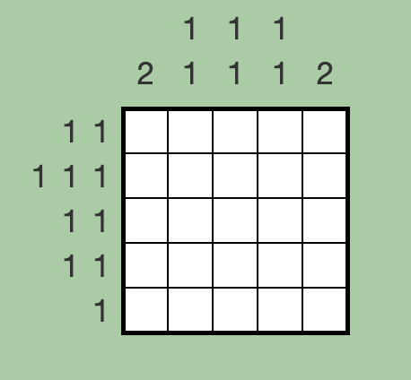

# NemoLogic.js

NemoLogic.js is a Javascript library for solving Nemonemo logic puzzles. It provides a flexible and efficient solution for solving puzzles of this type.



[This Puzzle URL](http://nemonemologic.com/play_logic.php?quid=1)

You can use this library for the above puzzle to get output like this:

```
□■□■□
■□■□■
■□□□■
□■□■□
□□■□□
```

## Features

- Solves Nemonemo logic puzzles with various configurations.

## Getting Started

### Prerequisites

- node.js 14 or later

### Installation

```sh
$ npm i nemologic
```

### Usage

1. Initialize NemoLogicSolver with row and column hints.

For the puzzle example above, you need to pass the following hint parameter:

```js
const rowsHints = [[1, 1], [1, 1, 1], [1, 1], [1, 1], [1]];
const columnHints = [[2], [1, 1], [1, 1], [1, 1], [2]];

const solver = new NemoLogicSolver(rowsHints, columnHints, false);
```

2. Process and solve the puzzle:

```js
const answer = solver.process();
console.log(answer);
```

Check out some additional test examples:
[examples](https://github.com/nalutbae/nemologic.js/blob/main/__tests__/nemologic.solver.test.js)

### License

This project is licensed under the [The Apache License, Version 2.0](https://www.apache.org/licenses/LICENSE-2.0.txt)
